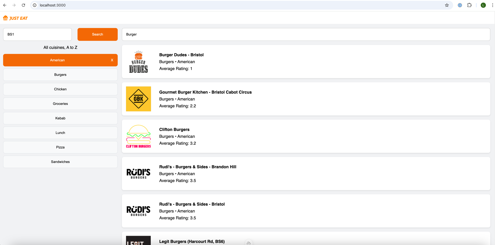

# Find Restaurant By Postcode

## Introduction

A simple Nuxt 3 + Typescript app for browsing restaurant listings based on postcode, cuisine types and restaurant name search.

Users can:

- View restaurant name, average rating score, and cuisine types for restaurants
- Change postcode to sea nearby restaurants.
- Filter restaurants by cuisines
- Filter restaurants by search name

### Example Screenshots



## Setup

Make sure to install dependencies:

```bash
# npm
npm install
```

## Development Server

Start the development server on `http://localhost:3000`:

```bash
# npm
npm run dev
```

## Production

Build the application for production:

```bash
# npm
npm run build
```

Locally preview production build:

```bash
# npm
npm run preview
```

## Testing

Run unit tests locally

```bash
# npm
npm run test
```
